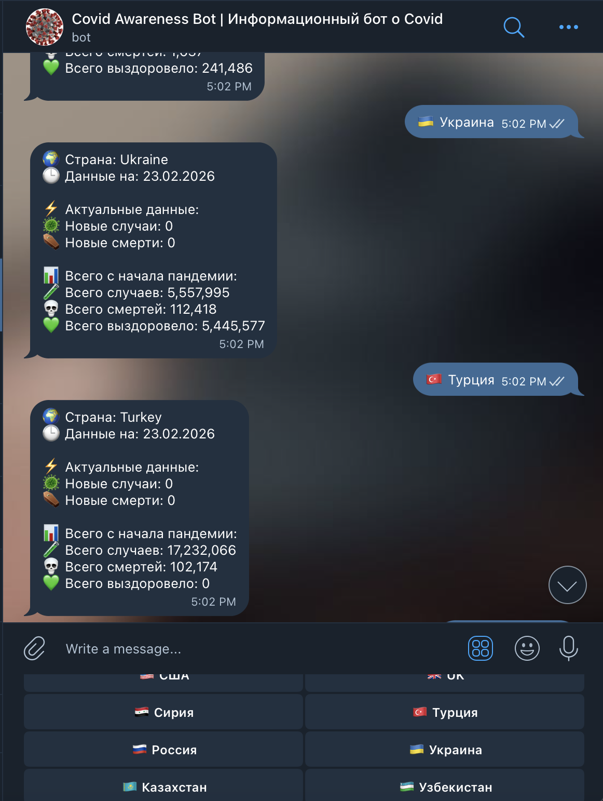

# COVID-19 Data Analytics Bot 🤖

[](README.md)
[](README.ru.md)
[](https://nodejs.org/)
[](https://t.me/stay_aware_of_covid19_bot)
[](LICENSE)
[](https://github.com/thedvlprs)


Intelligent Telegram bot providing real-time COVID-19 statistics with automated data validation and multi-format support. Built with Node.js and modern API integration.

**Live Demo:** @stay_aware_of_covid19_bot

<br />

<p align="center">

</p>

## 🚀 Key Features

- **Real-time Data**: Fetches live COVID-19 statistics from Johns Hopkins University via disease.sh API
- **Multi-language Support**: Accepts country names in English, Russian, and other languages  
- **Smart Fallback Logic**: Automatically switches between today's/yesterday's data when API returns zero values
- **Data Validation**: Handles null/undefined values gracefully with "Нет данных" placeholders
- **User-friendly Interface**: Interactive keyboard with flags, emoji-enhanced responses
- **Error Handling**: Robust retry logic for API failures and invalid country names

## 🛠 Technical Stack

- **Runtime**: Node.js
- **Framework**: Telegraf (Telegram Bot Framework)
- **API Integration**: disease.sh (Johns Hopkins University data)
- **Data Processing**: Custom formatting with toLocaleString() for readability
- **Environment**: dotenv for secure token management
- **Development**: nodemon for auto-restart during development

## 🎯 Challenges & Solutions

### Challenge 1: API Migration
**Problem**: Original `covid19-api` library became deprecated and returned HTML errors instead of JSON.
**Solution**: Migrated to direct API integration with disease.sh, implementing custom HTTPS request handling with proper error management.

### Challenge 2: Data Accuracy  
**Problem**: Many countries report 0 new cases for "today" due to reporting delays.
**Solution**: Implemented intelligent fallback using yesterday's data when today returns 0, ensuring users always see meaningful statistics.

### Challenge 3: Multi-format Input
**Problem**: Users input country names with flags (🇺🇸 США), mixed case, or various spellings.
**Solution**: Created comprehensive mapping dictionary with 100+ country aliases and flag-to-name conversion.

## 📊 Data Processing Pipeline

1. **Input Sanitization**: Removes emoji flags, special characters, normalizes case
2. **Country Mapping**: Extensive dictionary supporting 100+ countries in multiple languages  
3. **API Request**: Direct HTTPS call to disease.sh with retry logic
4. **Data Validation**: Checks for null/NaN/undefined before formatting
5. **Response Formatting**: Structured Markdown output with timestamps

## 🌟 Usage Examples

Users can interact with the bot using:
- Button clicks: 🇺🇸 США, 🇷🇺 Россия, 🇰🇿 Казахстан
- Text input: "USA", "usa", "США", "Россия", "russia"
- Mixed formats: "🇺🇸 USA", "russia", "Турция"

## 📝 What I Learned

- **API Integration**: Handling rate limits, errors, and data inconsistencies in third-party APIs
- **Data Validation**: Implementing robust null-checking and fallback strategies for unreliable data sources
- **Internationalization**: Supporting multiple input formats and languages in a single interface
- **Error Resilience**: Building systems that gracefully handle failures while maintaining user experience
- **Telegram Bot Architecture**: Understanding webhook vs polling, message handling, and UI design with keyboards

## 🚀 Deployment

### Railway (Recommended)
1. Push code to GitHub
2. Connect Railway to repository
3. Add environment variable `BOT_TOKEN`
4. Deploy automatically

### Fly.io
1. Install flyctl: `brew install flyctl`
2. Login: `fly auth login`
3. Initialize: `fly launch`
4. Set secret: `fly secrets set BOT_TOKEN=your_token`
5. Deploy: `fly deploy`

## 📂 Project Structure

```
├── bot.js           # Main bot logic
├── constants.js     # Country list for /help
├── package.json     # Dependencies
├── .env.example     # Environment variables template
└── README.md        # Documentation
```

## 🔒 Security

- Tokens and secrets stored in environment variables (never commit to Git!)
- `.gitignore` protects sensitive files
- Environment examples provided in `.env.example`

## 📞 Contacts

- **Telegram Bot**: @stay_aware_of_covid19_bot
- **GitHub**: [nodejs-telegram-bot-covid19](https://github.com/thedvlprs/nodejs-telegram-bot-covid19)

---

⭐ **If this project is helpful - give it a star on GitHub!**